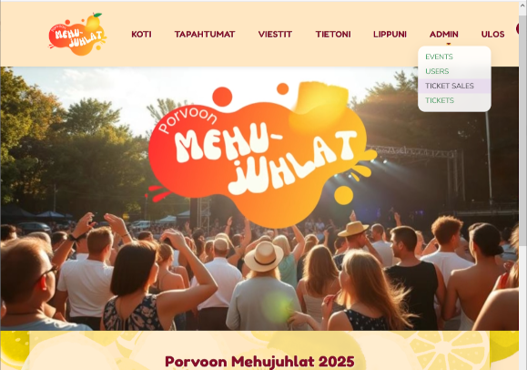

# Porvoon Mehujuhlat

Loppuprojekti Careerian ohjelmoinnin osatutkintoa varten (2025)  
Käytettyjä tekniikoita
<ul>
	<li>ASP.NET CORE 8</L>
	<li>MVC</li>
	<li>Entity Framework Core 9</li>
	<li>Azure KeyVault (ConnectionStringit ja salasanat)</li>
	<li>Azure BlobStorage (Kuvien säilytys)</li>
	<li>Signal R (Viestintä) </li>
	<li>Bootstrap 5 (Ulkoasu) </li>
	<li>QRCoder (Liput)</li>
</ul>

<strong>Tekijät</strong>  
- Tiina 
- Tuomas 
 

